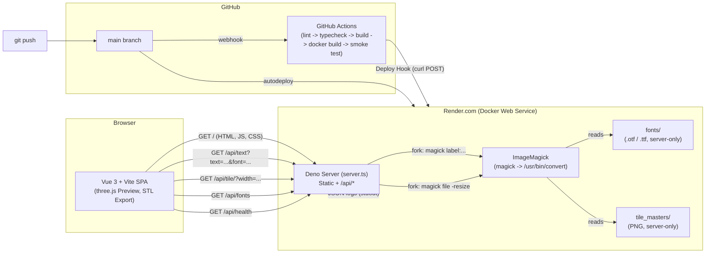
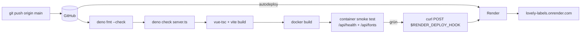

# Lovely Labels

Browser-side generator for 3D-printable name plates. Rasterizes text (or an uploaded image) into a greyscale depth map, displaces a mesh from it, optionally wraps a decorative tile-based frame around it, and exports binary STL.

**Live:** [https://lovely-labels.onrender.com](https://lovely-labels.onrender.com)
**Healthcheck:** [`/api/health`](https://lovely-labels.onrender.com/api/health) → `ok`

> This repository also serves as the LB2 submission for the **DEP** module
> (HF Informatik, FS26). See [§ Deployment](#deployment) and
> [§ Entscheidungsbegründungen](#entscheidungsbegründungen) for the parts
> directly graded against the rubric.

---

## Projektübersicht

Lovely Labels nimmt Text oder ein Bild, rastert es zu einer Tiefenkarte, formt daraus ein 3D-Mesh und liefert ein druckfertiges STL — alles im Browser, ohne dass der Nutzer eine CAD-Software installieren muss. Der Server bleibt absichtlich winzig: er liefert nur den statischen Client aus und stellt zwei kleine REST-Endpoints zur Verfügung, die lizenzierte Fonts und Tile-Master serverseitig rastern, ohne sie herunterzuladen.

Was die App produziert:

- 3D-Vorschau im Browser (three.js)
- Verzierter "Rahmen" rund um die Beschriftung (server-skalierte Tiles)
- Binäres STL zum Download → direkt in den Slicer

## Architekturübersicht



**Wichtige Eigenschaften:**

- **Stateless.** Keine Datenbank, keine Sessions. Jeder Render-Container ist austauschbar; Cache lebt nur im Prozess-RAM.
- **Single-Service.** Bewusst kein Compose-Multi-Service-Setup — es gibt schlicht keinen zweiten Prozess (kein Worker, keine DB, kein Cache-Server). Wäre Overhead.
- **Static-First.** Der Client ist ein vollständiges Vite-Bundle in `client/dist`; der Server dient ihn als reine statische Dateien aus. Erst wenn der Nutzer einen Server-Font oder ein Tile braucht, schlägt eine API-Route ein.

## Technologie-Stack

| Schicht | Technologie | Wofür |
|---|---|---|
| Client | Vue 3 (`<script setup>`) + Vite 5 + TypeScript | SPA-Build, reaktives UI |
| 3D | three.js + eigener WebGL2-Fragment-Shader | Depth-Map → Mesh, STL-Export |
| Server | Deno 2.1 (`Deno.serve`) | Statische Dateien + 4 API-Routes |
| Bildverarbeitung | ImageMagick 6 (Debian-Paket, via `magick`-Symlink) | Font-Rasterung, Tile-Resize |
| Container | Docker (Multi-Stage Build) | Reproduzierbares Runtime-Image |
| CI | GitHub Actions | Lint, Typecheck, Build, Docker-Smoke-Test, Deploy-Trigger |
| Hosting | Render.com (Docker Web Service, Free-Plan, Region Frankfurt) | Build + Runtime + HTTPS + Healthcheck |
| Lokales Hochfahren | Docker Compose | One-Liner `docker compose up --build` |

## Deployment

Dieser Abschnitt entspricht den sechs Produktionsreife-Merkmalen aus dem DEP-Auftrag.

| Merkmal | Wo umgesetzt |
|---|---|
| **Containerisiert** | [`Dockerfile`](Dockerfile) (Multi-Stage, Non-Root-User `deno`, gepinnte Versionen) + [`docker-compose.yml`](docker-compose.yml) für den lokalen One-Liner. |
| **Automatisiert** | [`.github/workflows/ci.yml`](.github/workflows/ci.yml) → fmt-Check → Typecheck → Vite-Build → Docker-Build → Container-Smoke-Test → Deploy-Hook. Render zieht den letzten `main`-Commit. |
| **Konfigurierbar** | Env-Vars (`PORT`, `MAGICK_BIN`). Beispiele in [`.env.example`](.env.example). Produktion: definiert in [`render.yaml`](render.yaml). Secrets liegen ausschliesslich in GitHub-Actions-Secrets bzw. im Render-Dashboard, nie im Code. |
| **Erreichbar** | Stabil unter [https://lovely-labels.onrender.com](https://lovely-labels.onrender.com) mit Cloudflare-HTTPS via Render. |
| **Überwachbar** | Strukturierte JSON-Logs auf stdout (12-Factor); Render's Log-Viewer fängt sie ein. Healthcheck-Endpoint `/api/health` ist in `render.yaml` als `healthCheckPath` registriert und auch Teil des Compose-Healthchecks. |
| **Dokumentiert** | Dieses README + [`screencast_skript.md`](screencast_skript.md). |

### CI/CD-Pipeline im Detail



Branch-Strategie: nur `main` deployt. PRs durchlaufen denselben Build-Job, lösen aber keinen Deploy aus — so kann Production nie aus einem ungeprüften Branch entstehen.

### Setup-Anleitung (in unter 30 Minuten reproduzierbar)

**Voraussetzungen:** Docker (Engine 24+) und ein GitHub-Account. Optional Deno 2.1 + Node 20 für die "ohne Docker"-Variante.

**A) Nur lokal starten (One-Liner):**

```bash
git clone git@github.com:veryos-git/lovely_labels.git
cd lovely_labels
docker compose up --build
# Öffne http://localhost:8080
```

Das war's. Das Compose-File startet den Container mit eingebautem Healthcheck.

**B) Auf Render deployen (eigene Instanz):**

1. Repo zu deinem eigenen GitHub-Account forken (Repository muss privat bleiben, weil lizenzierte Fonts/Tile-Master darin liegen).
2. Render-Account anlegen.
3. **New + → Blueprint** → Fork-Repository wählen. Render liest `render.yaml`, erstellt den Service `lovely-labels`, baut das Docker-Image, startet den Container. Erste Build-Zeit ~5-10 Min.
4. Service-Seite → **Settings → Deploy Hook** → URL kopieren.
5. Im GitHub-Repo: **Settings → Secrets and variables → Actions → New repository secret** → Name `RENDER_DEPLOY_HOOK`, Wert = die kopierte URL.
6. Trivial-Commit auf `main` → GitHub Actions läuft grün → Render startet neuen Deploy → fertig.

**C) Ohne Docker (Dev-Mode):**

```bash
deno task install         # client deps
deno task dev             # Vite-Dev-Server :5173 (HMR)
# in einem zweiten Terminal:
deno task serve           # API-Server :8080
# Vite proxied /api/* automatisch
```

**Eigene Assets:**

- Fonts (`.otf`/`.ttf`) in `fonts/` (Unterordner OK).
- Tile-Quellen (`.tif`) in `tiffs/`, dann `deno task build-tiles` → erzeugt `tile_masters/*.png` + `client/public/tiles/*.thumb.png` + `manifest.json`. Voraussetzung: `magick` auf dem `PATH`.

## Entscheidungsbegründungen

| Entscheidung | Warum | Verworfene Alternative |
|---|---|---|
| **Render statt Vercel/Fly/Railway** | Free-Plan reicht für eine Single-Service-Demo, ist nicht serverless (Cold-Start-Probleme mit ImageMagick wären ein Risiko), beherrscht Docker-Web-Services nativ, und der Blueprint (`render.yaml`) ist als Infrastructure-as-Code-Beleg im Modul-Sinn ideal. | Vercel scheidet aus (Serverless, ImageMagick-Subprozess wäre eine Layer-Bastelei). Fly.io wäre auch passend, ist aber komplexer für ein One-Service-Setup. |
| **Docker statt Render-Native-Runtime** | Mit Dockerfile entscheide ich exakt, welche ImageMagick-Version und Deno-Version laufen — Render's Native-Runtimes bieten kein offizielles Deno, und ImageMagick müsste über Build-Scripts installiert werden. Multi-Stage spart außerdem Image-Grösse (kein Node im Runtime-Image). | Native Deno-Buildpack (existiert teils auf Render, ist aber fragil); Render-eigener Server hätte ImageMagick erst recht nicht. |
| **Deno statt Node/Express** | Server ist 350 Zeilen, ein `Deno.serve` reicht völlig. Deno hat ein eingebautes Permission-System (`--allow-run=magick`), das im Sicherheits-Kapitel des Moduls direkt das Prinzip "minimale Berechtigungen" demonstriert. TypeScript ohne Build-Tooling. | Node + Express wäre üblicher, aber mit `package.json`-Overhead und ohne natives Permission-Modell. |
| **ImageMagick 6 (Debian) statt IM7-Standalone-Binary** | Spart ~80 MB im Image und einen weiteren Build-Schritt. Die genutzten Optionen (`-resize`, `-colorspace`, `label:`) sind in IM6 und IM7 identisch; ein Symlink `magick → convert` macht den Aufruf in Code und Permissions versionsunabhängig. | IM7 statisches Binary herunterladen — funktioniert, ist aber unnötig komplex. |
| **Lizenzierte Assets ins (private) Repo** | Render baut aus Git, also müssen Fonts/Tile-Master im Build-Context liegen. Eine externe Registry oder Render-Disk wäre zusätzlicher beweglicher Teil. Solange das Repo privat bleibt, ist das vertretbar. Die alten `.gitignore`-Regeln stehen kommentiert oben in `.gitignore` und lassen sich für ein Public-Switch in 30 Sekunden reaktivieren. | Render Persistent Disk (manuelles SCP nach jedem Deploy) oder Docker-Image vorab in Registry pushen (zusätzliche Pipeline). |
| **JSON-Logs auf stdout statt File-/Service-Logger** | 12-Factor: die App weiss nichts über den Log-Sink. Render zeigt sie im Dashboard, lokal stehen sie in der Konsole, und ein späterer K8s-Sidecar (Loki/ELK) würde sie ohne Code-Änderung einsammeln. | Pino/Winston (Node-Welt — überdimensioniert für eine Hand voll Log-Calls). |
| **Non-Root-Container** | Render rotiert UID nicht selbst, also reduziert ein non-root Prozess den Blast Radius einer hypothetischen RCE. Die `denoland/deno`-Base bringt den User schon mit. | Default-Root — schneller, aber Punktabzug im Raster. |

## Learnings

- **Image-Name-Stolperfalle:** `denoland/deno:debian` heisst beim Push so, intern lautet die Variante mit `apt`-Paketmanager aber `debian-2.1.4`. Erste Build-Iteration kratzte am `alpine`-Image, wo `apt-get install imagemagick` natürlich fehlschlug — Lesson learned: Base-Image-Variante explizit fixieren, nie einfach `latest`.
- **`magick` vs. `convert`:** Auf meinem Dev-System läuft IM7 (`magick`), Debian Bookworm liefert IM6 (`convert`). Ohne Symlink hätte der erste Render-Deploy mit "command not found" geendet. Die Lehre: Permissions/Konfiguration im Code an einen Alias binden, nicht direkt an den Pfad — dann reicht ein `ln -s` im Dockerfile, um die beiden Welten zu überbrücken.
- **Render's Autodeploy + CI-Hook = doppelter Trigger:** Beide laufen aktuell parallel. Funktional unschädlich, aber für ein streng CI-gegatetes Deployment müsste man `autoDeploy: false` setzen und sich nur auf den Hook verlassen. Bewusst nicht umgestellt, weil der "naive" Pfad für eine Demo-App stabiler und nachvollziehbarer ist.
- **Healthcheck-Lärm vs. -Nutzen:** Render pollt `/api/health` aggressiv. Erste Log-Version hat jede Probe geloggt → Render-Log war binnen Minuten unleserlich. Filter im `finally`-Block kostet zwei Zeilen, macht aber den Log überhaupt erst auswertbar — kleine Sache, grosser Praxis-Unterschied.
- **Rückblickend anders:** Für ein produktives Setup hätte ich ein **Smoke-Test-Endpoint mit fester Erwartung** ausgebaut (z. B. `/api/text?text=test&font=...` mit PNG-Byte-Vergleich gegen ein Goldfile), statt nur das HTTP-200 zu prüfen. Das CI würde dann nicht nur "Server lebt", sondern "Server kann tatsächlich Bilder produzieren" testen.

## Server-rendered fonts

Drop `.ttf` or `.otf` files anywhere under `fonts/` (subdirectories OK). The server scans the tree on first request and exposes each file as a dropdown entry; the client renders text by fetching `GET /api/text?text=…&font=<id>&fontPx=…`, which shells out to ImageMagick. Font files are gitignored by default (see top of `.gitignore`) and never bundled into `client/dist`, so licensed fonts stay on the server.

## Tile assets

The decorative frame samples horizontally-seamless greyscale tiles. Drop source `.tif` files into `tiffs/` (or `horizontal_tiles/` for older checkouts) and run:

```bash
deno task build-tiles    # requires `magick` (ImageMagick) on PATH
```

The build emits two things:

- `tile_masters/<id>.png` — 2048 px server-only greyscale masters. **Not shipped to the client.** Resized copies are served on demand via `GET /api/tile/<id>?width=<bucket>`, where `<bucket>` is one of `128, 256, 512, 1024, 2048`. The client snaps the bucket up from the resolution it actually needs for the current `tileScaleMm × vertexDensity`.
- `client/public/tiles/<id>.thumb.png` — ≤64 px thumbnails used by the tile picker grid, plus `manifest.json` listing every tile.

## Reference object

The 3D preview can show a 180 mm banana as a scale reference (toggle in the Debug section). Drop a CC0 low-poly banana at `client/public/reference/banana.glb` for the real model; otherwise the renderer falls back to a procedural curved-tube stand-in.

## API

| Methode | Pfad | Zweck |
|---|---|---|
| GET | `/api/health` | Liveness/Readiness, antwortet `ok`. Wird im Compose-Healthcheck und in `render.yaml` (`healthCheckPath`) genutzt. |
| GET | `/api/fonts` | JSON-Liste der auf dem Server verfügbaren Fonts. |
| GET | `/api/text?text=<s>&font=<id>&fontPx=<n>` | Rastert Text als PNG mit der gewählten Font. |
| GET | `/api/tile/<id>?width=<128\|256\|512\|1024\|2048>` | Liefert einen passenden Greyscale-PNG-Master für den dekorativen Rahmen. |

## Layout

```
client/                   # Vite + Vue 3 SPA
  src/
    main.ts, App.vue, types.ts
    components/           # UI panels
    composables/          # depth-map / mesh / WebGL / layout / STL helpers
  public/
    tiles/                # manifest.json + tile-thumbnails (build output)
    reference/            # optional banana.glb
fonts/                    # licensed .otf/.ttf, server-only
tile_masters/             # full-res tile PNGs, server-only
tiffs/                    # licensed source artwork, build-time only (gitignored)
scripts/
  build_tiles.ts          # tiffs/ -> tile_masters/ + thumbnails
deno.json
server.ts                 # Deno HTTP server + /api/*
Dockerfile                # multi-stage, non-root
docker-compose.yml        # local one-liner
render.yaml               # Render Blueprint
.github/workflows/ci.yml  # CI/CD pipeline
.env.example              # documented runtime config
screencast_skript.md      # LB2 Screencast outline
```

## Run (Dev-Tasks ohne Docker)

```bash
deno task install        # one-time: cd client && npm install
deno task dev            # vite dev server (recommended while iterating)
deno task build          # vue-tsc + vite build → client/dist
deno task serve          # serve client/dist + /api/* via server.ts
deno task start          # build + serve
```

## Einsatz von KI-Tools

Dieses Repository wurde unter Mitwirkung von **Claude Code (Anthropic, Modell Opus 4.7)** entwickelt. Konkret:

- Initial-Prototyp der Vue/Three-Komponenten und des Deno-Servers wurde mit KI-Unterstützung erstellt (siehe `prompt.txt`).
- Dockerfile, `docker-compose.yml`, `render.yaml`, GitHub-Actions-Workflow und JSON-Logging wurden gemeinsam mit Claude erarbeitet und in dieser README dokumentiert.
- Sämtliche Designentscheidungen, Konfigurationen und Trade-offs wurden vom Autor reviewed und nachvollzogen — die Begründungen in [§ Entscheidungsbegründungen](#entscheidungsbegründungen) spiegeln meine bewusste Auswahl, nicht den Default-Vorschlag der KI.
- KI-generierter Code ist nicht gesondert markiert, weil das gesamte Projekt iterativ Mensch-KI entstanden ist — der Autor kann auf Nachfrage jede Datei erklären.
